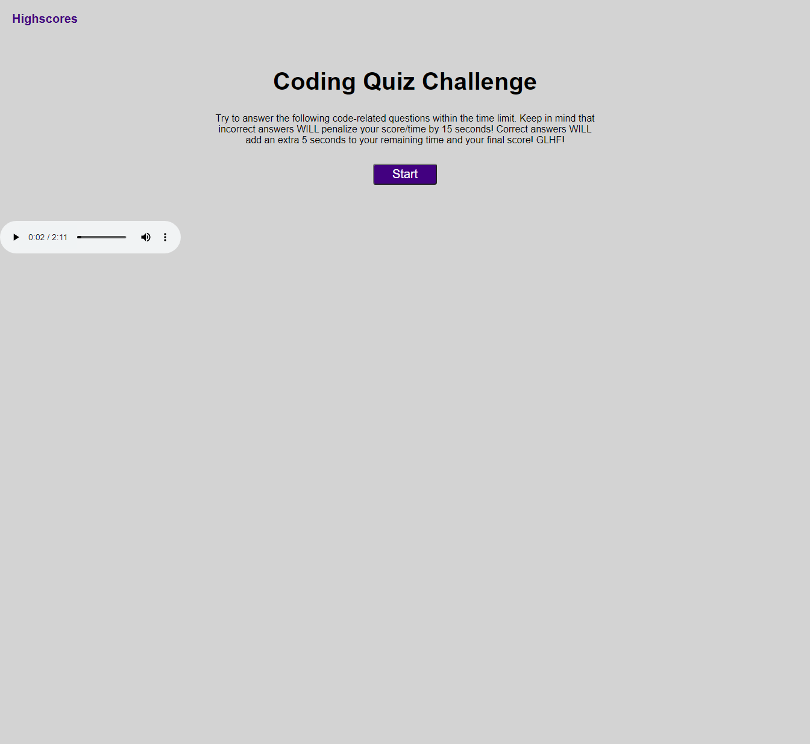

# My Portfolio
## Description
- The goal of this project was to develop a working mini quiz that can be used by any and all to stress themselves out while learning.
- Utilizing a well made quiz can help anyone make sure they are learning and retaining information via trial and error.
- Creating this mini quiz has again increased my working knowledge regarding the possibilities available to me using Javascript.

## Usage
- When enterering the application, simply click the button, then follow the multiple choice questions to run through the quiz. Remember there will be time added or subtracted depending on whether you get the questions right or wrong.
- VOLUME WARNING UPON PAGE LOAD!!!
- Github repo is viewable here: https://github.com/henlowgg/Quickest-Coding-Quiz
- Site is viewable at: https://henlowgg.github.io/Quickest-Coding-Quiz/
- Preview: 

## Credits
- Leif E. Hetland for helping me to understand functioning code and how to utilize JS.
- Rebecca for testing project to make sure it works. Rebecca's Github can be found here: https://github.com/yinzhedy
- https://coding-boot-camp.github.io/full-stack/github/professional-readme-guide for the README layout.
- https://choosealicense.com/licenses/mit/ for the copyright layout.
## License
- 

Copyright (c) [2021] [Jack Ault]

Permission is hereby granted, free of charge, to any person obtaining a copy
of this software and associated documentation files (the "Software"), to deal in the Software without restriction, including without limitation the rights to use, copy, modify, merge, publish, distribute, sublicense, and/or sell copies of the Software, and to permit persons to whom the Software is
furnished to do so, subject to the following conditions:

The above copyright notice and this permission notice shall be included in all copies or substantial portions of the Software.

THE SOFTWARE IS PROVIDED "AS IS", WITHOUT WARRANTY OF ANY KIND, EXPRESS OR
IMPLIED, INCLUDING BUT NOT LIMITED TO THE WARRANTIES OF MERCHANTABILITY,
FITNESS FOR A PARTICULAR PURPOSE AND NONINFRINGEMENT. IN NO EVENT SHALL THE
AUTHORS OR COPYRIGHT HOLDERS BE LIABLE FOR ANY CLAIM, DAMAGES OR OTHER
LIABILITY, WHETHER IN AN ACTION OF CONTRACT, TORT OR OTHERWISE, ARISING FROM, OUT OF OR IN CONNECTION WITH THE SOFTWARE OR THE USE OR OTHER DEALINGS IN THE SOFTWARE.